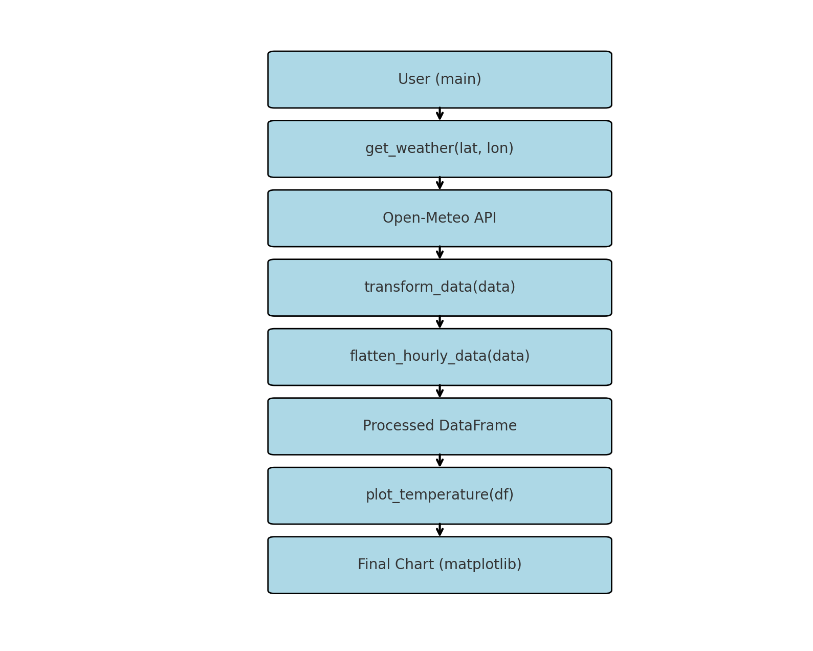

# Weather Forecast Data Processor

This Python script retrieves hourly weather forecast data from the [Open-Meteo API](https://open-meteo.com/), processes it into a clean and structured format using `pandas`, and generates a temperature-over-time chart using `matplotlib`.

## Features

- Fetches hourly weather data from Open-Meteo based on latitude and longitude.
- Flattens and transforms nested JSON data into a well-structured `DataFrame`.
- Extracts and renames relevant fields (e.g., temperature, units, metadata).
- Visualizes temperature trends for a configurable number of hours (default: 24).
- Uses clean function separation and development best practices.

## How It Works

The script consists of the following components:

1. `get_weather()` – Calls the Open-Meteo API and retrieves forecast data in JSON format.
2. `flatten_hourly_data()` – Unpacks nested hourly data and adds top-level metadata and units.
3. `transform_data()` – Cleans and reshapes the data for visualization.
4. `plot_temperature()` – Plots the temperature trend using `matplotlib`.
5. `main()` – Orchestrates the process from fetching to visualization.

## Architecture Diagram

Below is a high-level overview of the script’s architecture:



## How to Run

1. Make sure you have Python 3 installed.
2. Install the required dependencies:
   ```bash
   pip install pandas matplotlib´´´

## Run the script

    ```python weather.py´´´

    The default coordinates are set to lat=4.0, lon=-10.0. You can modify these inside the main() function.

## Output   

- A printed preview of the structured weather DataFrame
- A line chart displaying temperature over time